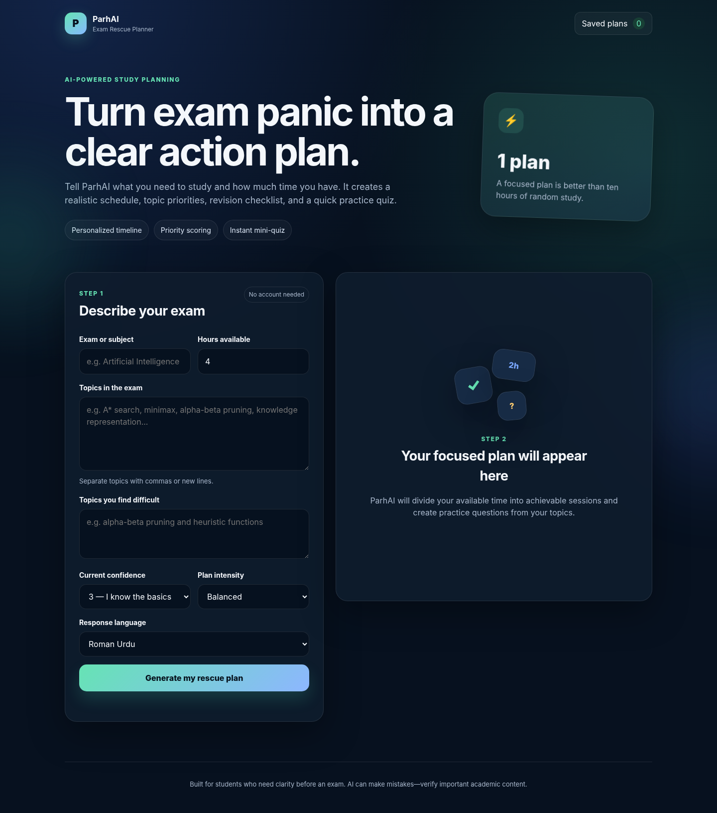
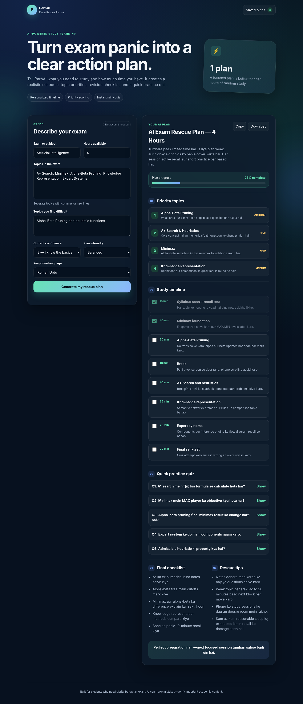
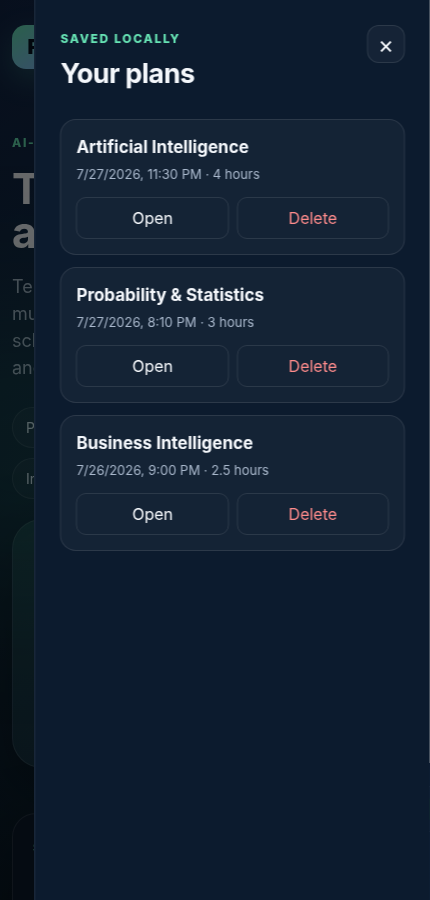

# ParhAI — Exam Rescue Planner

> An AI-powered emergency study planner that turns limited exam-preparation time into a realistic schedule, topic priorities, active-recall tasks, and a mini practice quiz.

## Live App

**Live URL:** https://parhai-exam-rescue.vercel.app/`


## The Real Problem

Students often become overwhelmed when an exam is close and the syllabus is still incomplete. They may spend their remaining time rereading random notes, give equal time to easy and difficult topics, forget breaks, or avoid practice questions completely.

**ParhAI** is designed for university and college students who need an immediate, personalized, and achievable study strategy. The student enters the exam topics, weak areas, confidence level, and available hours. The app then uses AI to build a focused rescue plan that fits the student's exact time limit.

This problem is based on a real student experience: having an exam the next day, limited preparation time, and uncertainty about what to study first.

## Features

- Personalized AI study plan based on the exam, topics, weak areas, confidence, and available time.
- Priority ranking that explains why each topic should be studied first.
- Time-blocked study timeline with focused learning methods and short breaks.
- Interactive completion checkboxes and a live progress bar.
- Five AI-generated practice questions with revealable answers.
- Final revision checklist and practical exam-rescue tips.
- English, Urdu, and Roman Urdu response options.
- Balanced, intensive, and gentle planning modes.
- Saves up to eight plans locally in the browser without requiring an account.
- Reopens or deletes saved plans from the history drawer.
- Copies the complete study plan to the clipboard.
- Downloads the plan as a text file.
- Responsive interface for desktop and mobile devices.
- Server-side API route so the Gemini API key is never exposed in browser code.

## AI Feature

ParhAI sends the student's form data to a Vercel serverless function. The function builds a structured request and calls the Google Gemini API. Gemini returns JSON containing the title, summary, priority topics, timeline, quiz, checklist, tips, and motivation. The frontend converts this structured response into an interactive study dashboard.

### Model

- Default model: `gemini-3.6-flash`
- Automatic fallback: `gemini-3.5-flash-lite`
- Provider: Google Gemini API

The model can be changed through the optional `GEMINI_MODEL` environment variable.

### System Prompt / Instructions

```text
You are ParhAI, an emergency exam-planning assistant for university and college students.
Your job is to convert a student's limited remaining time into a realistic, high-value study plan.

Rules:
1. Prioritize understanding and active recall over passive rereading.
2. Give more time to weak and high-yield topics, but still include short coverage of all listed topics.
3. Never claim guaranteed marks or success.
4. Keep the plan achievable within the exact number of hours provided.
5. Include short breaks. Do not recommend unsafe sleep deprivation, stimulant misuse, or skipping essential meals.
6. Create quiz questions only from the topics supplied by the student.
7. Use the requested response language consistently.
8. Return only valid JSON. Do not wrap JSON in markdown.

Return this exact structure:
{
  "title": "short plan title",
  "summary": "2-3 sentence overview",
  "priorities": [
    {"topic": "topic name", "reason": "why it comes first", "level": "Critical|High|Medium"}
  ],
  "timeline": [
    {"duration": "e.g. 35 min", "task": "specific task", "method": "exact study method"}
  ],
  "quiz": [
    {"question": "question", "answer": "concise correct answer"}
  ],
  "checklist": ["item"],
  "tips": ["short practical tip"],
  "motivation": "one honest motivating line"
}

Quality requirements:
- 3 to 6 priority topics.
- 5 to 10 timeline blocks whose study and break durations add up approximately to the available time.
- Exactly 5 quiz questions.
- 4 to 6 checklist items.
- 3 to 5 tips.
```

## Screenshots

### 1. Home and exam input form



### 2. AI-generated rescue plan



### 3. Saved plans on mobile



## Tools and Services Used

- HTML5 for semantic page structure.
- CSS3 for the responsive interface, gradients, cards, and mobile layout.
- Vanilla JavaScript for form handling, rendering, progress tracking, browser storage, copy, and download features.
- Node.js serverless function for secure AI requests.
- Google Gemini API for plan and quiz generation.
- Browser `localStorage` for saved plans and completion progress.
- GitHub for public source-code hosting.
- Vercel for the live frontend and serverless API deployment.

No frontend framework or copied template was used. The interface, prompt, data structure, and application logic were created specifically for this project.

## Project Structure

```text
parhai-exam-rescue/
├── api/
│   └── generate.js       # Secure Gemini serverless function
├── screenshots/
│   ├── 01-home.png
│   ├── 02-ai-plan.png
│   └── 03-saved-plans.png
├── .env.example          # Required environment variable names
├── .gitignore            # Prevents secrets and local files from being committed
├── app.js                # Frontend functionality
├── index.html            # App interface
├── LICENSE
├── package.json
├── styles.css            # Responsive visual design
└── vercel.json           # Deployment and security headers
```

## Run Locally

### Prerequisites

- Node.js 20 or newer
- A Google Gemini API key
- Vercel CLI

### Steps

1. Clone the repository:

```bash
git clone YOUR_PUBLIC_GITHUB_REPOSITORY_URL
cd parhai-exam-rescue
```

2. Install Vercel CLI if it is not already installed:

```bash
npm install -g vercel
```

3. Create a `.env.local` file:

```env
GEMINI_API_KEY=your_google_ai_studio_api_key
GEMINI_MODEL=gemini-3.6-flash
```

4. Start the local development server:

```bash
vercel dev
```

5. Open the local URL shown in the terminal, normally `http://localhost:3000`.

## Deploy on Vercel

1. Push the complete project to a **public** GitHub repository.
2. Open Vercel and choose **Add New → Project**.
3. Import the GitHub repository.
4. Open **Environment Variables** before deployment.
5. Add:

```text
Name: GEMINI_API_KEY
Value: your real Gemini API key
```

6. Optionally add:

```text
Name: GEMINI_MODEL
Value: gemini-3.6-flash
```

7. Deploy the project.
8. Open the public URL and generate a real study plan.
9. Add the final URL to the **Live App** section at the top of this README.
10. Commit and push the updated README.

## Security

- The Gemini API key is read only inside `api/generate.js` on the server.
- `.env` and `.env.local` are excluded through `.gitignore`.
- No API key is stored in `index.html`, `app.js`, screenshots, or the public repository.
- Input length and numeric ranges are validated on both the frontend and server.

## Limitations and Responsible Use

AI-generated educational content can occasionally be incomplete or incorrect. Students should verify important definitions, formulas, and answers using their course material. ParhAI helps organize preparation; it does not guarantee grades or replace learning.

## Author

Built as an individual final project by **Nainsee** for the ACT AI course.

## License

This project is released under the MIT License.
